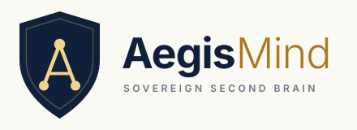

<div align="center">



# AegisMind

**Sovereign Enterprise Knowledge Engine & Offline AI Agent**

*Modular enterprise knowledge platform and personal intelligence layer with sovereign document-level access control enforced strictly at retrieval time.*

[](https://www.python.org/downloads/)
[](#system-architecture)
[](#permission-and-security-model)
[](#testing-and-verification)
[](https://github.com/astral-sh/ruff)
[](https://mypy-lang.org/)
[](apps/lens)
[](LICENSE)

</div>

---

## Table of Contents

- [Overview](#overview)
- [Key Features](#key-features)
- [System Architecture](#system-architecture)
  - [Hexagonal Core and Dynamic Adapters](#hexagonal-core-and-dynamic-adapters)
  - [Architecture Diagram](#architecture-diagram)
- [Detailed Component Deep-Dives](#detailed-component-deep-dives)
  - [1. Sovereign Long-Term Memory (LTM) Engine](#1-sovereign-long-term-memory-ltm-engine)
  - [2. Persistent Local Knowledge Graph](#2-persistent-local-knowledge-graph)
  - [3. Human-in-the-Loop Approval Gate](#3-human-in-the-loop-approval-gate)
  - [4. 7-Stage Sovereign Retrieval Pipeline](#4-7-stage-sovereign-retrieval-pipeline)
  - [5. Sandboxed Sovereign Agent and Local Tools](#5-sandboxed-sovereign-agent-and-local-tools)
  - [6. Enterprise Connectors and Ingestion SDK](#6-enterprise-connectors-and-ingestion-sdk)
  - [7. Lens Web Interface (React 19)](#7-lens-web-interface-react-19)
- [Workspace Monorepo Layout](#workspace-monorepo-layout)
- [Quickstart Guide](#quickstart-guide)
  - [Prerequisites](#prerequisites)
  - [Automated Setup (Recommended)](#automated-setup-recommended)
  - [Manual Step-by-Step Setup](#manual-step-by-step-setup)
  - [Full Enterprise Stack (Docker Compose)](#full-enterprise-stack-docker-compose)
- [Configuration and Environment Variables](#configuration-and-environment-variables)
- [REST API Reference](#rest-api-reference)
- [Permission and Security Model](#permission-and-security-model)
- [Testing and Verification](#testing-and-verification)
- [Engineering Standards](#engineering-standards)
- [Contributing and Community](#contributing-and-community)
- [License](#license)

---

## Overview

**AegisMind** is an open-source, modular enterprise knowledge platform and sovereign local AI agent engineered around clean hexagonal architecture (Ports and Adapters). It solves the critical enterprise security challenge of authorization leakage in retrieval-augmented generation (RAG) by guaranteeing mathematical document-level access control enforced strictly during retrieval before any reranking or generation occurs.

AegisMind provides two unified operational modes:

1. **Local Sovereign Agent Mode (100% Air-Gapped)**: A personal intelligence layer operating completely offline on your workstation. It uses local Ollama models (such as Llama 3.2, Qwen 2.5), zero-GPU ONNX embeddings via FastEmbed, an embedded SQLite vector store, a local JSON knowledge graph, and strictly sandboxed system diagnostic tools. Zero cloud calls, zero external network traffic, and zero telemetry.
2. **Enterprise Multi-Tenant Stack (Production Scale)**: A distributed cluster featuring PostgreSQL with `pgvector`, HuggingFace Text Embeddings Inference (TEI), cross-encoder rerankers, relation-based access control (ReBAC) with `at_least_as_fresh` consistency tokens, and OpenTelemetry instrumentation.

Whether deployed as a sovereign personal second brain or as a multi-tenant enterprise intelligence hub, AegisMind guarantees uncompromising privacy, auditability, and safety.

---

## Key Features

- **Authz-Before-Rerank Enforcement**: Document permissions are evaluated during candidate retrieval before cross-encoder reranking and token budgeting. Unauthorized chunks are purged upfront, preventing permission leakage, cache poisoning, and prompt injection attacks.
- **Sovereign Long-Term Memory (LTM)**: Local-first memory persistence powered by SQLite WAL mode and FTS5 full-text indexing. Supports four distinct memory types (Semantic, Episodic, Procedural, Preference) with status transitions (`pending`, `active`, `rejected`, `superseded`, `forgotten`).
- **Cryptographic Tamper-Evident Audit Logging**: Immutable memory event logging with SHA-256 hash chaining and SQLite trigger protections preventing update or deletion of historical audit logs.
- **Automated Pre-Write Secret Guard**: All agent memories and text inputs are analyzed across seven regex security patterns (API keys, PEM private keys, password assignments, bearer tokens, AWS credentials, GitHub tokens) before disk writes.
- **Persistent Local Knowledge Graph**: Graph engine with BFS traversals, automatic entity extraction, relationship linking, and graph-augmented prompt enrichment. Includes interactive SVG graph visualization in the UI.
- **Human-in-the-Loop Approval Gate**: Action governance for agent tool executions. High-risk write and execute actions require explicit human operator approval via a persistent review queue.
- **7-Stage Hybrid Retrieval Pipeline**: Dense vector similarity, sparse BM25 lexical search, Reciprocal Rank Fusion (RRF), candidate overfetching (3x to 5x multiplier), bulk sovereign authorization, cross-encoder reranking, and token budgeting with Maximal Marginal Relevance (MMR).
- **Sandboxed Agent Tool Runtime**: Safely execute local diagnostic commands, read allowlisted workspace files with path-traversal prevention, take structured notes with YAML frontmatter, and query local offline vector stores.
- **Live Tool Activity Audit Feed**: Real-time server-sent events (SSE) feed tracking every agent tool invocation, input payload, execution status, and human approval decision.
- **Connector SDK & Ingestion Engine**: Extensible connector SDK with change detection, cryptographic content hashing, sensitive-file denylists, and Dead Letter Queue (DLQ) support for local files, GitHub repositories, and Gmail.
- **Lens Web Interface**: High-performance React 19 interface built with Vite and Tailwind CSS. Features real-time chat with streaming responses, interactive SVG knowledge graph exploration, memory vault management, approval gate controls, and document ingestion tools.
- **Strict Hexagonal Architecture**: Complete decoupling of business domain rules from storage, models, and external APIs. Pluggable adapters register via Python entry points and dynamic registry lookup.

---

## System Architecture

### Hexagonal Core and Dynamic Adapters

AegisMind is built upon the Ports and Adapters (hexagonal) pattern:
- **Core Domain and Ports**: Core packages define abstract protocols (ports) and business domain logic. Core modules never import concrete adapters directly.
- **Dynamic Adapter Resolution**: Concrete adapters register via Python entry points and are dynamically discovered through `aegismind_core.registry`.
- **Bring Your Own Model (BYOM)**: Embedders, vector databases, rerankers, and LLMs can be swapped via configuration without touching business logic.

### Architecture Diagram

```
                              +---------------------------------------+
                              |         Lens Web UI (React 19)        |
                              |  [Chat] [Graph] [Approvals] [Memory]  |
                              |  [Tools] [Datasets] [Notes Vault]     |
                              +-------------------+-------------------+
                                                  | HTTP / SSE / REST
                                                  v
 +------------------------------------------------------------------------------------+
 |                                Agora API (FastAPI)                                 |
 +----------------------------------------+-------------------------------------------+
 | Enterprise Retrieval Pipeline          | Sovereign Local Agent Loop                |
 |  0. Query Rewriting & Normalization    |  - ReAct Autonomous Execution Loop        |
 |  1. Dense Cosine Vector Search         |  - LTM Context Retrieval & Injection      |
 |  2. Sparse Lexical BM25 Search         |  - Knowledge Graph Entity Enrichment      |
 |  3. Reciprocal Rank Fusion (RRF)       |  - Human-in-the-Loop Approval Gate        |
 |  4. Candidate Overfetching (3x-5x)     |  - Sandboxed Diagnostic Tool Adapters     |
 |  5. Bulk Sovereign Authorization Check |  - Pre-Write Secret Guard & Sanitization  |
 |  6. Cross-Encoder Relevance Rerank     |  - Live Activity Audit Streaming (SSE)    |
 |  7. MMR Diversity & Token Budgeting    |                                           |
 +-------------------+--------------------+---------------------+---------------------+
                     |                                          |
                     v                                          v
 +----------------------------------------+   +---------------------------------------+
 | Enterprise Infrastructure (Scale)      |   | Sovereign Local Adapters (Air-Gapped) |
 |  - PostgreSQL with pgvector Adapter    |   |  - SQLite Vector Store (WAL Mode)     |
 |  - Sovereign ReBAC Authorization Engine|   |  - SQLite LTM Store (FTS5 + Hash Log) |
 |  - HuggingFace TEI Embedder & Reranker |   |  - Persistent JSON Knowledge Graph    |
 |  - S3-Compatible Object Store          |   |  - Local Filesystem Connector         |
 |  - OpenTelemetry Tracing & Prometheus  |   |  - Local Ollama LLM (Llama, Qwen)     |
 +----------------------------------------+   +---------------------------------------+
```

---

## Detailed Component Deep-Dives

### 1. Sovereign Long-Term Memory (LTM) Engine

The Long-Term Memory subsystem (`aegismind_core.memory`) provides persistent, self-governing memory for the local AI agent:

- **Storage Architecture**: Backed by a local SQLite database (`ltm.db`) running in Write-Ahead Logging (WAL) mode for high-concurrency reading and writing.
- **Lexical and Semantic Search**: Combines SQLite FTS5 full-text indexing with vector similarity search for hybrid retrieval.
- **Four Memory Classifications**:
  1. *Semantic*: Enduring facts, concepts, and domain knowledge.
  2. *Episodic*: Chronological interaction events and conversation summaries.
  3. *Procedural*: Workflow instructions, operational constraints, and task patterns.
  4. *Preference*: User preferences for tone, formatting, language, and display styles.
- **Status Lifecycle**:
  - `pending`: Extracted candidate memory awaiting human review.
  - `active`: Verified and approved memory actively used during context assembly.
  - `rejected`: Candidate memory declined during review.
  - `superseded`: Historical memory replaced by updated facts, preserving the lineage chain.
  - `forgotten`: Tombstoned memory excluded from retrieval until administrative purge.
- **Hybrid Retrieval Scoring**:
  Memories are retrieved using Reciprocal Rank Fusion (RRF) combined with importance weighting, exponential time decay, and pin boosts:

  $$\text{RRF}(m) = \sum_{l \in \{\text{FTS5}, \text{Vector}\}} \frac{1}{60 + \text{rank}_l(m)}$$

  $$\text{Score} = 0.55 \cdot \frac{\text{RRF}(m)}{\max(\text{RRF})} + 0.25 \cdot \text{importance} + 0.20 \cdot 2^{-\frac{\Delta t}{30}} + (0.05 \text{ if pinned else } 0)$$

- **Cryptographic Audit Chain**: Every memory creation, update, approval, rejection, or purge event is logged to the `memory_events` table with SHA-256 hash chains. SQLite triggers abort any modification or deletion attempts on audit rows.
- **Pre-Write Secret Guard**: Regex scanners reject writes containing API keys, private keys, passwords, bearer tokens, AWS credentials, or personal access tokens.
- **Private Mode Isolation**: When `private_mode=True` is requested, memory retrieval and post-turn extraction are disabled for zero-trace conversations.
- **Automated Memory Consolidation**: Scheduled maintenance purges tombstones, applies exponential recency decay, merges duplicate facts, and resolves contradictions.

### 2. Persistent Local Knowledge Graph

The knowledge graph subsystem (`aegismind-graph`) organizes enterprise and personal concepts into an interconnected graph:

- **Graph Storage**: Persists entities and relationships locally in JSON and SQLite without external graph database dependencies.
- **Entity and Relation Types**: Models nodes for people, projects, concepts, documents, and decisions, connected by typed relationships (`works_on`, `depends_on`, `decided_in`, `documents`).
- **Graph-Augmented Retrieval**: Performs Breadth-First Search (BFS) traversals from extracted query entities to retrieve 1-hop and 2-hop graph neighborhoods, injecting structured context into the agent prompt.
- **Interactive Lens Visualization**: The Lens frontend renders nodes and edges via dynamic SVG with category filtering, physics-based positioning, node inspection cards, and relationship highlights.

### 3. Human-in-the-Loop Approval Gate

The approval gate (`aegismind-approval` and `aegismind_core.approvals`) enforces human supervision over autonomous actions:

- **Policy Evaluation**: Every agent action is classified into risk tiers (`read`, `write`, `execute`).
- **Proposal Registration**: When an action involves disk writes, state modifications, or external commands, the agent creates an approval proposal containing the target tool, arguments, rationale, and diff preview.
- **Interactive Review Queue**: The operator reviews pending proposals via the Lens UI or REST API, with options to approve or reject with comments.
- **Execution Verification**: Tool execution adapters verify approval tokens before proceeding. Unapproved or rejected actions are blocked immediately.

### 4. 7-Stage Sovereign Retrieval Pipeline

AegisMind employs a rigorous seven-stage retrieval pipeline that enforces document-level authorization before scoring:

1. **Stage 0 - Query Rewriting**: Normalizes user input, expands domain acronyms, and resolves conversational references.
2. **Stage 1 & 2 - Dense and Sparse Retrieval**: Performs parallel dense semantic search and sparse lexical BM25 search.
3. **Stage 3 - Reciprocal Rank Fusion (RRF)**: Merges rank lists with balanced weighting.
4. **Stage 4 - Overfetching Candidates**: Gathers between 3x and 5x the requested `top_k` candidates to preserve statistical recall after security filtering.
5. **Stage 5 - Bulk Sovereign Authorization Check**: Queries the authorization engine (`authz.bulk_check`) using `at_least_as_fresh` consistency tokens. Unauthorized documents and chunks are permanently purged from the candidate set.
6. **Stage 6 - Cross-Encoder Relevance Reranking**: Applies a cross-encoder model exclusively to the authorized candidate pool.
7. **Stage 7 - MMR Diversity and Context Budgeting**: Maximizes Marginal Relevance (MMR) for candidate diversity and fits citations within LLM context token windows.

### 5. Sandboxed Sovereign Agent and Local Tools

The local agent loop (`aegismind_core.agent`) executes a ReAct pattern equipped with sandboxed local diagnostic tools:

- `search_local_knowledge`: Queries ingested local document chunks using dense and lexical search.
- `read_system_file`: Reads files from configured root directories (`LOCAL_ALLOWLIST_ROOTS`). Strictly validates paths and blocks directory traversal attempts (`..`).
- `create_note`: Writes structured markdown notes with YAML frontmatter to `.aegismind/notes/`.
- `run_local_command`: Executes allowlisted diagnostic commands (for example `ping`, `hostname`, `systeminfo`, `git status`). Rejects shell metacharacters (`;`, `|`, `&`, backticks, redirects), tokenizes arguments via `shlex.split`, enforces timeouts, and records structured audit logs.
- `LocalToolActivityRecorder`: Tracks tool runs in an in-memory ring buffer and streams live updates via SSE to the Lens UI.

### 6. Enterprise Connectors and Ingestion SDK

The ingestion engine and Connector SDK (`aegismind-connector-sdk`, `connectors/*`) safely ingest heterogeneous document sources:

- **Change Detection**: Computes SHA-256 content hashes to skip unchanged files and generate tombstones for deleted documents.
- **Sensitive Path Denylist**: Automatically ignores paths matching `.ssh/`, `.env`, `*credentials*`, `*id_rsa*`, `.aws/`, `*.pem`, or `*.key`.
- **Connector Implementations**:
  - `local_filesystem`: Air-gapped offline filesystem crawler.
  - `github`: Ingests repositories, pull requests, and commits via OAuth credentials.
  - `gmail`: Secure read-only email ingestion via Google OAuth.
- **Multi-Format Parsers**: Native parsing for PDF (`pypdf`), Microsoft Word (`python-docx`), PowerPoint (`python-pptx`), Markdown, and plain text.
- **Dead Letter Queue (DLQ)**: Failed ingestion records are captured in the DLQ with inspect and retry capabilities.

### 7. Lens Web Interface (React 19)

The modern web application in `apps/lens` provides complete visibility and control:

- **Conversational Studio**: Real-time streaming chat with model selection, citations, memory injection indicators, and private mode toggle.
- **Interactive Knowledge Graph Visualizer**: SVG canvas for exploring entities, relationship linkages, cluster filters, and node attributes.
- **Memory Vault**: Search, filter by type and status, approve pending memories, review hash-chained audit trails, and trigger manual consolidation.
- **Approval Gate Panel**: Live queue of agent proposals with action summaries, risk badges, and one-click approve/reject actions.
- **Datasets and Ingestion Manager**: Drag-and-drop document upload, file parsing status, connector synchronization, and document-specific chat.
- **Notes Vault**: Searchable markdown notes manager with tag filtering and YAML metadata inspection.
- **Local Tools Activity Feed**: Real-time streaming event log displaying executed commands, tool inputs, outputs, and runtime durations.
- **Command Palette**: Fast navigation shortcut accessible via `Cmd+K` or `Ctrl+K`.

---

## Workspace Monorepo Layout

AegisMind is structured as a monorepo leveraging `uv` workspaces for Python packages and `pnpm` workspaces for TypeScript applications:

```
aegisMind/
├── apps/
│   ├── lens/                     # React 19 + Vite web interface
│   └── scout/                    # Lightweight CLI / evaluation harness
├── packages/
│   ├── aegismind-core/           # FastAPI Agora server, ReAct agent loop, memory, routes
│   ├── aegismind-types/          # Pydantic v2 schemas, chunks, ACL, and domain models
│   ├── aegismind-authz/          # Sovereign ReBAC authorization engine and memory adapter
│   ├── aegismind-retrieval/      # Vector stores (pgvector, SQLite), embedders, rerankers, RRF
│   ├── aegismind-ingestion/      # Document parsers, text chunkers, DLQ, versioning
│   ├── aegismind-graph/          # Persistent Knowledge Graph engine, BFS, entity extraction
│   ├── aegismind-approval/       # Approval Gate models, policy engine, and review queue
│   ├── aegismind-identity/       # OIDC identity propagation and group alias mapping
│   ├── aegismind-infra/          # Secret storage, envelope encryption, and S3 adapters
│   ├── aegismind-connector-sdk/  # Connector port specifications, verification harness, guards
│   └── aegismind-mcp-bridge/     # Model Context Protocol bridge adapter
├── connectors/
│   ├── local_filesystem/         # Air-gapped offline directory ingestion connector
│   ├── github/                   # GitHub repository and PR ingestion connector
│   └── gmail/                    # Read-only Gmail message connector
├── deploy/
│   ├── docker/                   # Production multi-stage Dockerfiles
│   └── migrations/               # PostgreSQL Alembic schema migrations
├── docs/
│   ├── architecture/             # Architecture, consistency, and multi-tenancy documentation
│   └── memory.md                 # Detailed Long-Term Memory system specification
├── scripts/
│   ├── setup.ps1                 # Automated Windows PowerShell environment bootstrapper
│   ├── start.ps1                 # Automated multi-process backend & frontend launcher
│   ├── seed_graph.py             # Knowledge graph initial dataset seeder
│   ├── prune_memory.py           # Long-term memory maintenance and compaction script
│   └── cleanup_activity.py       # Activity buffer cleanup utility
└── tests/                        # Comprehensive unit, integration, guardrail, and eval tests
```

---

## Quickstart Guide

### Prerequisites

Ensure the following tools are installed on your workstation:

- **Python 3.12+**: Required for all backend packages.
- **uv**: Ultra-fast Python package and workspace manager (`pip install uv` or via standalone installer).
- **Node.js 18+ and pnpm**: Required for the Lens frontend (`npm install -g pnpm`).
- **Ollama**: Required for local sovereign LLMs and embeddings.
- **Docker** *(Optional)*: Only required if running the full enterprise stack with PostgreSQL and TEI.

### Automated Setup (Recommended)

AegisMind includes automated PowerShell scripts to initialize and launch the entire stack:

#### 1. Start Ollama and Pull Local Models
```powershell
ollama serve
ollama pull llama3.2:latest
ollama pull nomic-embed-text:latest
ollama pull qwen2.5:7b
```

#### 2. Run the Setup Bootstrapper
```powershell
Set-Location -LiteralPath "path\to\aegisMind"
.\scripts\setup.ps1
```
This script performs virtual environment synchronization, installs all internal packages in editable mode, builds the frontend dependencies, and seeds the initial knowledge graph.

#### 3. Start Backend and Frontend
```powershell
.\scripts\start.ps1
```

Once running, navigate to **[http://localhost:3000](http://localhost:3000)** in your browser.

---

### Manual Step-by-Step Setup

If you prefer to configure each component manually:

#### 1. Python Environment Setup
```powershell
# Sync monorepo dependencies
uv sync --all-groups

# Install internal workspace packages in editable mode
uv pip install -e packages/aegismind-types
uv pip install -e packages/aegismind-connector-sdk
uv pip install -e packages/aegismind-infra
uv pip install -e packages/aegismind-identity
uv pip install -e packages/aegismind-retrieval
uv pip install -e packages/aegismind-ingestion
uv pip install -e packages/aegismind-graph
uv pip install -e packages/aegismind-approval
uv pip install -e packages/aegismind-core
uv pip install -e connectors/local_filesystem
uv pip install -e connectors/github
uv pip install -e connectors/gmail
```

#### 2. Environment Configuration
Copy the configuration template:
```powershell
Copy-Item .env.example .env
```

#### 3. Seed Knowledge Graph
```powershell
python scripts/seed_graph.py
```

#### 4. Launch Backend API Server
```powershell
uv run uvicorn aegismind_core.app:app --reload --host 0.0.0.0 --port 8000
```

#### 5. Launch Lens Frontend
In a separate terminal:
```powershell
cd apps/lens
pnpm install
pnpm dev
```
Open **[http://localhost:3000](http://localhost:3000)**.

---

### Full Enterprise Stack (Docker Compose)

To spin up the containerized enterprise infrastructure including PostgreSQL with `pgvector`, HuggingFace TEI Embedder, TEI Reranker, and Agora API:

```powershell
# Launch enterprise infrastructure
docker compose up -d

# Verify container health
docker compose ps
```

---

## Configuration and Environment Variables

AegisMind is configured using environment variables loaded from `.env`:

| Variable | Default Value | Description |
| :--- | :--- | :--- |
| `AEGISMIND_ENV` | `development` | Runtime environment mode (`development`, `production`, `test`). |
| `AEGISMIND_LOG_LEVEL` | `INFO` | Structured logging verbosity level (`DEBUG`, `INFO`, `WARNING`, `ERROR`). |
| `AEGISMIND_API_HOST` | `0.0.0.0` | Bind host address for the FastAPI backend. |
| `AEGISMIND_API_PORT` | `8000` | Port for the FastAPI backend server. |
| `OLLAMA_URL` | `http://localhost:11434` | Endpoint for the local Ollama instance. |
| `OLLAMA_MODEL` | `llama3.2:latest` | Default local LLM for agent reasoning and memory extraction. |
| `LOCAL_ALLOWLIST_ROOTS` | `.` | Semicolon or comma separated paths accessible to agent file reader. |
| `LOCAL_NOTES_DIR` | `./notes` | Directory for agent-created markdown notes. |
| `LENS_APP_URL` | `http://localhost:3000` | Frontend URL for CORS and OAuth redirects. |
| `RETRIEVAL_OVERFETCH_MIN_FACTOR` | `3.0` | Minimum candidate overfetch multiplier for authz filtering. |
| `RETRIEVAL_OVERFETCH_MAX_FACTOR` | `5.0` | Maximum candidate overfetch multiplier for authz filtering. |
| `RETRIEVAL_DEFAULT_OVERFETCH_FACTOR`| `4.0` | Default multiplier for candidate overfetching. |
| `RETRIEVAL_DEFAULT_TOP_K` | `5` | Default number of final authorized results returned. |
| `GITHUB_OAUTH_CLIENT_ID` | `""` | GitHub OAuth client ID for repository connector. |
| `GITHUB_OAUTH_CLIENT_SECRET` | `""` | GitHub OAuth client secret. |
| `GOOGLE_OAUTH_CLIENT_ID` | `""` | Google OAuth client ID for Gmail connector. |
| `GOOGLE_OAUTH_CLIENT_SECRET` | `""` | Google OAuth client secret. |
| `OAUTH_REDIRECT_BASE` | `http://127.0.0.1:8000` | Base callback URL for OAuth handshakes. |

---

## REST API Reference

The Agora API exposes clean RESTful endpoints for all core operations:

### Chat and Autonomous Agent
- `GET /chat` & `GET /chat/stream`: Standard conversational endpoints with Server-Sent Events (SSE).
- `POST /agent/chat`: Sovereign ReAct agent loop execution with memory, graph, and tool usage.
- `GET /agent/tools`: List all registered tools and their input schemas.
- `GET /local-tools/activity`: Retrieve recent local tool activity records.
- `GET /local-tools/events`: SSE stream of real-time tool execution events.

### Long-Term Memory (LTM)
- `GET /memory/records`: Query memories with filters for status, type, query string, and pagination.
- `GET /memory/records/{memory_id}`: Retrieve a single memory by ID.
- `PATCH /memory/records/{memory_id}`: Update memory attributes, status, importance, or pin state.
- `DELETE /memory/records/{memory_id}`: Tombstone a memory record.
- `GET /memory/records/{memory_id}/audit`: Fetch cryptographic SHA-256 audit history for a memory.
- `POST /memory/extract`: Trigger LLM memory extraction from a conversation turn.
- `GET /memory/stats`: Return total memory counts categorized by type and status.

### Knowledge Graph
- `GET /graph/nodes`: List knowledge graph entity nodes with optional type filtering.
- `GET /graph/edges`: List relationship links between graph nodes.
- `GET /graph/stats`: Summary statistics of entities and relationships.
- `GET /graph/query`: Execute BFS neighborhood search centered on given entities.

### Approval Gate
- `POST /approval/propose`: Register an action proposal requiring human review.
- `GET /approval/pending`: Retrieve pending proposals awaiting decisions.
- `POST /approval/decide`: Submit an approval or rejection decision.
- `GET /approval/stats`: Metrics on approved, rejected, and pending actions.

### Ingestion, Datasets, and Connectors
- `POST /documents/upload`: Upload and ingest files (PDF, Word, PPTX, Markdown, plain text).
- `POST /search`: Execute the 7-stage hybrid authorized retrieval pipeline.
- `GET /connectors`: List all available data source connectors and connection states.
- `POST /connectors/{connector_id}/sync`: Trigger asynchronous synchronization on a connector.
- `GET /dlq`: View items in the Dead Letter Queue.
- `POST /dlq/{item_id}/retry`: Retry processing on a failed ingestion record.

### System and Diagnostics
- `GET /health`: Liveness probe endpoint.
- `GET /readiness`: Readiness probe inspecting dependencies (database, storage, models).
- `GET /metrics`: Prometheus metrics scrape endpoint.

---

## Permission and Security Model

AegisMind treats authorization correctness as non-negotiable:

1. **Authz-Before-Rerank Pipeline**:
   Traditional RAG systems rerank retrieved candidates before applying permissions, leaking document existence and wasting compute on inaccessible items. AegisMind overfetches candidate chunks (3x to 5x of requested top_k), validates every chunk ID against the sovereign authorization engine in a single bulk check, discards unauthorized candidates, and delivers only permitted items to the reranker and synthesis stages.

2. **ReBAC Authorization Consistency**:
   All authorization checks execute using `at_least_as_fresh` consistency tokens, eliminating stale reads and ensuring revoked access is respected instantaneously.

3. **Sandboxed Filesystem Guard**:
   The `read_system_file` tool rejects any path containing traversal characters (`..`) or targeting paths outside allowlisted root directories before performing disk operations.

4. **Command Execution Guard**:
   The `run_local_command` tool strictly rejects shell metacharacters (`;`, `|`, `&`, backticks, redirects), tokenizes commands via `shlex.split`, matches commands against an allowlist of read-only diagnostics, and logs full execution details.

5. **Sensitive File Denylist**:
   The ingestion engine skips indexing of files matching `.ssh/`, `.env`, `*credentials*`, `*id_rsa*`, `.aws/`, `*.pem`, or `*.key`.

---

## Testing and Verification

AegisMind includes over 350 automated tests covering unit, integration, conformance, and security guardrail behaviors.

### Run Test Suite
```powershell
uv run pytest -v
```

### Run Permission and Guardrail Tests
```powershell
uv run pytest -m guardrail
```

### Run Static Type Checking
```powershell
uv run mypy packages connectors tests
```

### Run Linter and Code Formatter
```powershell
uv run ruff check .
uv run ruff format --check .
```

### Build Frontend Application
```powershell
pnpm --filter lens build
```

---

## Engineering Standards

Every contribution to AegisMind adheres to strict architectural guidelines:

- **Writing Convention**: No em dashes anywhere in code, docstrings, markdown documents, or git commit messages. Commas, periods, colons, or parentheses are used instead.
- **Hexagonal Architecture**: Business logic in core packages depends exclusively on abstract interfaces (ports). Concrete implementations (adapters) are resolved dynamically.
- **Python Modernity**: Python 3.12 or newer. Every module begins with `from __future__ import annotations`. Strict static type annotations across all functions and classes.
- **Data Modeling**: Pydantic v2 models for all requests, responses, and internal domain contracts.
- **Structured Logging**: No bare `print` statements. All components use `logging.getLogger(__name__)` with structured metadata.
- **Commit Hygiene**: Conventional Commits specification (`feat:`, `fix:`, `docs:`, `test:`, `chore:`).

---

## Contributing and Community

We welcome contributions to AegisMind! Please review our community guidelines before submitting pull requests:

- [Contributing Guide](CONTRIBUTING.md)
- [Code of Conduct](CODE_OF_CONDUCT.md)
- [Security Policy](SECURITY.md)

---

## License

AegisMind is licensed under the **Apache License, Version 2.0**. See the [LICENSE](LICENSE) file for complete terms.
